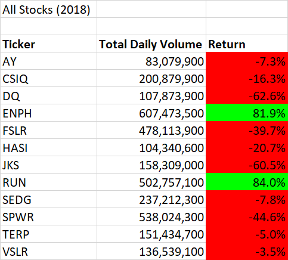
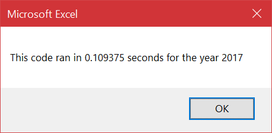
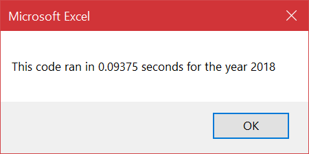

# Stock Analysis


## Overview


The purpose of this analysis came from an original desire by a friend, to find the total daily volume and yearly return on each stock in a data set of stocks. The scope of the project began by starting small and focusing on a request from the parents of your friend. This rapidly grew into a robust macro that utilized the datasets provided to find exactly what the total daily volume and yearly returns for any stock from either years worksheet. Once the final function and aesthetic details were applied, the code was refactored to help tidy and tighten it up.  This resulted in a more efficient macro that scaled better to handle the rigors of larger datasets.


## Results of the Stock Analysis

### The Beginning
The desire and scope on the project was a daunting one at first, but a request to get just a specific portion of data helped focus it down. At the behest of your friends’ parents the analysis started with specifically finding the return on a DAQO stock in 2018. Datasets were provided for 2017 and 2018 that covered a variety of stocks. This included the DAQO stock—and other data—that could be used to create a solution to the posed problem. Using the data scraped through scripting, the total daily volume and yearly return were found using VBA script's `for` loops and `if-then` statements. These numbers were then formatted into a separate and finalized worksheet for ease of viewing. At this point, only the DQ stock data had been scraped and compiled, which left the grand majority of the datasets unused.

### The Project Scales
At this point the project turned to creating code that would include the whole dataset, which in turn would be boiled down to their essential parts in relation to their specific stock. The focus not on refining but realizing even more solutions. The resulting code was maybe not as elegant of a solution, but again the point was to get a script working that was capable of doing more. For this first attempt, `for` loops were heavily utilized to perform the loops necessary to capture the whole dataset.

```
For i = 0 To 11
                
                ticker = tickers(i)
                totalVolume = 0
                    
                    '5) loop through rows in the data
                    Worksheets(yearValue).Activate
                    
                    For j = 2 To RowCount
                    
                        '5a) Get total volume for current ticker
                        If Cells(j, 1).Value = ticker Then
                        
                            totalVolume = totalVolume + Cells(j, 8).Value
                            
                            
                        End If
                        
                            '5b) Get starting price for current ticker
                            If Cells(j - 1, 1).Value <> ticker And Cells(j, 1).Value = ticker Then
                                
startingPrice = Cells(j, 6).Value
                            
                            End If
                        
                                '5c) Get ending price for current ticker
                                If Cells(j + 1, 1).Value <> ticker And Cells(j, 1).Value = ticker Then
 
                                    endingPrice = Cells(j, 6).Value
                                
                                End If
                 
Next j
```
</br>


### The First Go
If statements were used within the `for` loop to collect the necessary data as the macros went over the data within each row. This starting script was fleshed out so when it was run it would query an end user for which year they wanted, and use `for` loops to answer total daily volume and return of each stock. 
This data was then displayed on a separate worksheet with static and conditional formatting of the results from the code. Finally, ease of use was implemented for the end user with buttons to run the macros. A clear function was scripted and attached to a button on the separate worksheet. Another button would retrieve the requested results of all the stocks that could be compared between the two years provided. The requested summations being total daily volume and return of all the stocks provided:




Noticeably 2017 was a better year across the board for nearly every stock. This gave a complete look over the datasheet and allowed for more information to be derrived from these datasheets besides the obvious. But, this was not the end of the analysis. At least not the analysis on the macro itself.
The code was slow, relatively. It could be tightened up further, especially if it was to be scalable. This would be a necessary step, due to the nature of the data that was being captured and computed. Stocks are not small data sets, and slow code only gets slower the more it has to do. Refactoring finds the correct tools for the job, instead of the one created for the time being.

)


**Original Code 2017 = 626.25 ms	/  Original Code 2018 = 671.87 ms**
</br>
### Refactoring takes effect
Within the refactored code, the main difference was the removal of the nested `for` loops, and its replacement with `if-then` statements which utilized arrays. This made the task of collecting all of the data more efficient. The refactored code also was tested for how long the script ran. The results showing a more efficient computation time across the board.

```
For i = 2 To RowCount
    
        '3a) Increase volume for current ticker
        tickerVolumes(tickerIndex) = tickerVolumes(tickerIndex) + Cells(i, 8).Value
        
        '3b) Check if the current row is the first row with the selected tickerIndex.
        If Cells(i, 1).Value = tickers(tickerIndex) And Cells(i - 1, 1).Value <> tickers(tickerIndex) Then
            tickerStartingPrice(tickerIndex) = Cells(i, 6).Value
        End If
        
        '3c) check if the current row is the last row with the selected ticker
        If Cells(i, 1).Value = tickers(tickerIndex) And Cells(i + 1, 1).Value <> tickers(tickerIndex) Then
            tickerEndingPrice(tickerIndex) = Cells(i, 6).Value
        End If
        'If the next row’s ticker doesn’t match, increase the tickerIndex
            '3d Increase the tickerIndex.
            If Cells(i, 1).Value = tickers(tickerIndex) And Cells(i + 1, 1).Value <> tickers(tickerIndex) Then
                tickerIndex = tickerIndex + 1
            End If
    
    Next i
```
</br>


The actual difference between the original and refactored code can be most clearly seen in actual milliseconds. The calculation time was roughly six times faster for both datasets. This improvement was necessary if the code was to be sustainable for future use cases where it would be scaled further.






**Refactored Code 2017 = 109.37 ms / Refactored Code 2018 = 93.75 ms**
</br>

 ## Summary of the Analysis
	
### Advantages and Disadvantages of Refactored Code
Since this was an educational exercise, refactoring code can only be mainly advantageous. This is a skill set that with experience will yield better code from a programmer. It does take time with a learning programmer spending time researching and experimenting. Thus, in a real setting, the disadvantage would soon show itself in time spent not working on more code. Refactoring code becomes a luxury, and not pertinent to the actual task at hand. This would be a beginner’s mistake that would resolve over time. Becoming comfortable and knowledgeable with the code erodes this disadvantage, since the refactoring would be happening as the code is written, and polish found faster when a second go at it is done. It is a vicious cycle, since to gain this knowledge, refactoring is key which relies on time management and focus by the programmer.

### On the advantages and disadvantages of the original and refactored VBA script
This final point will consider the analysis as an example within a vacuum. Time spent refactoring a trivial script to squeeze a few milliseconds out was allotted for this exercise. It was also done after coming to all necessary solutions, the advantages completely outweighing any disadvantage in this vacuum.  
It is completely to my benefit that I spend time with the code to learn and build a more logical and efficient product. One that does scale well, and does its job with as little overhead as possible. These advantages and disadvantages only immerge when a question of project completion and timing is required, and the proficiency of the developer in Visual Basic script. This shapes the produced code, which should always have the advantage of some sort of refactoring involved.
